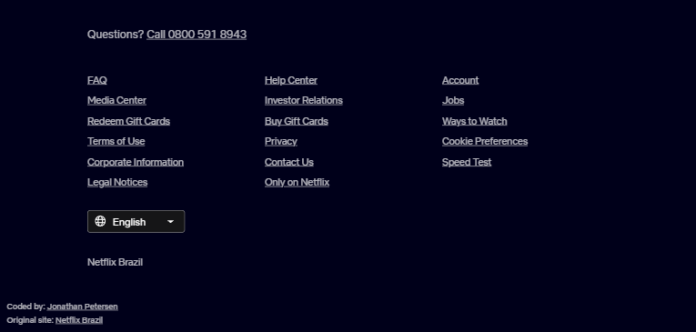

# Netflix landing page clone

[Live site URL](https://netflix-clone-htcsjs.vercel.app)  
[Side Notes](#side-notes)

### Tools I used:

* React.js
* Typescript React (tsx)
* Vite

### Features

* Hover states for buttons and inputs
* Responsive (i used mobile first approach when coding this)
* Custom scrollbar so the site looks more aesthetic

### Optimal viewing screen dimensions

1325 x 637
(My browser window inner width & height)

### Screenshots

### Side Notes:

This is how the Netflix landing page looked as of April 22 2023, if you are in the future the original site might look completely different!
 
And trust me, they change the site fairly often (i had to redo this site 3 times while coding it thanks to them changing it so often LMAO).
 
 
Also i'm brazilian so this clone is based off of the BR-EN version of the site (hence some of the info like prices are in BRL but the text is in english). I'm not sure if the site's design changes completely depending on the country you are in but there is a chance it does so that's the reason for this side note.

**If you ares still reading this, thanks for checking out this project, i hope you like it, and that it looks good on your screen size :)**